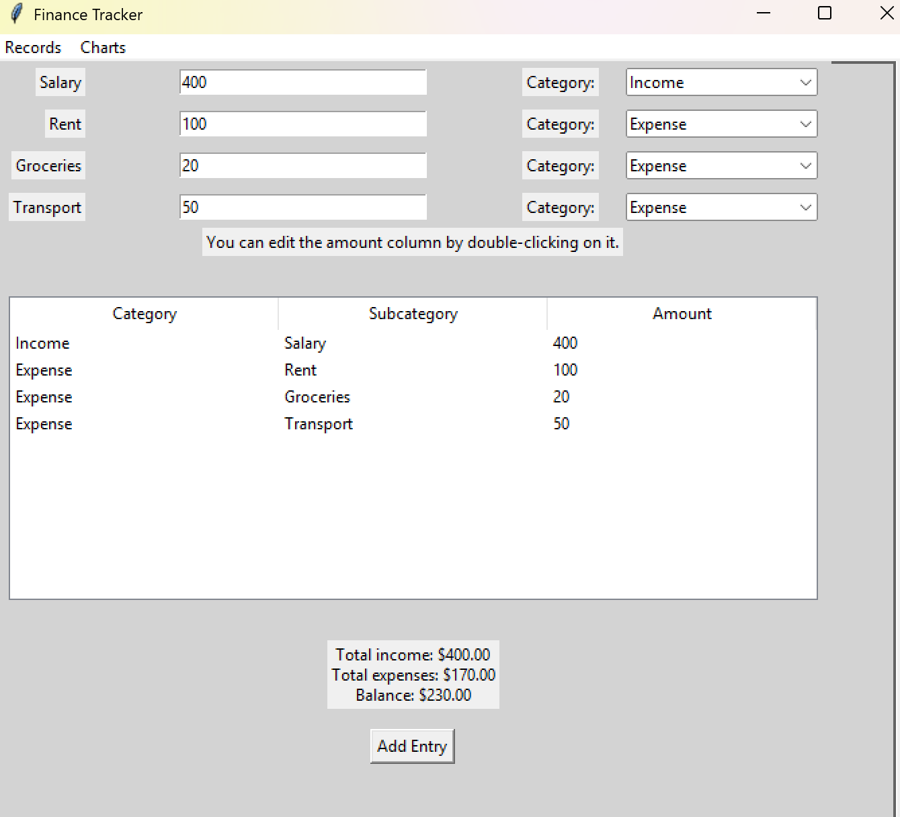
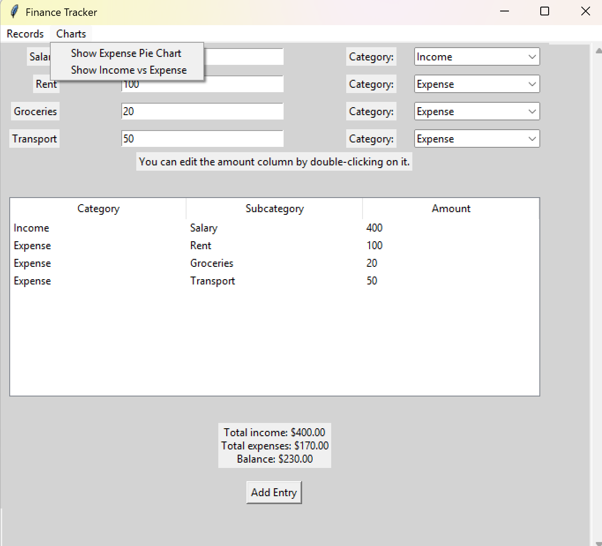
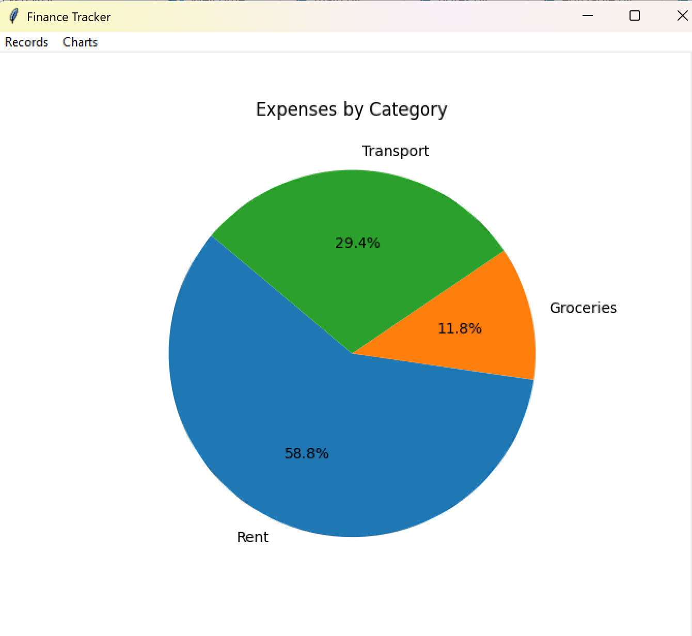
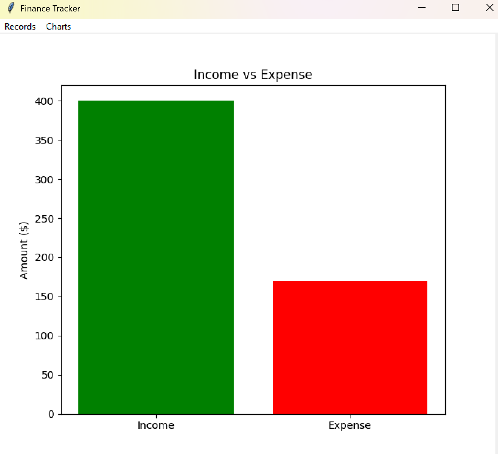
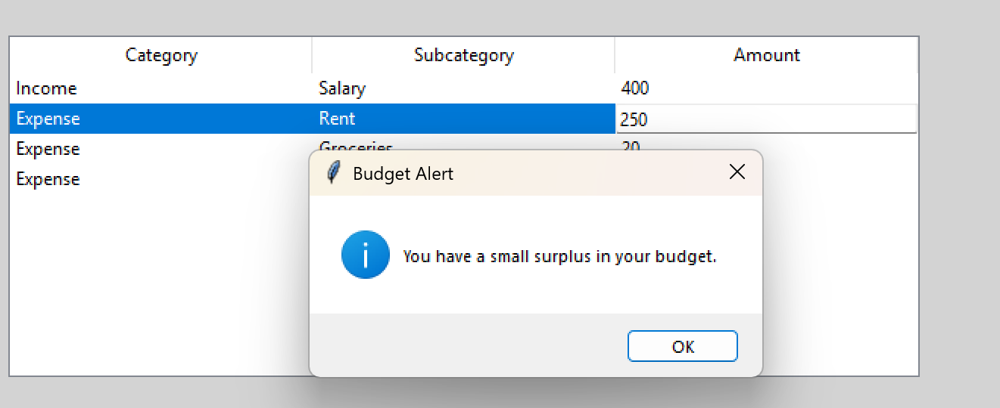
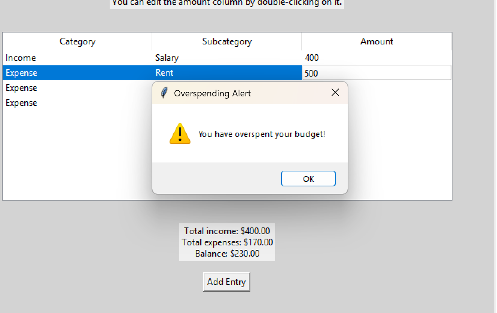

<a id="readme-top"></a>
<!-- TABLE OF CONTENTS -->
<details>
  <summary>Table of Contents</summary>
  <ol>
    <li>
      <a href="#about-the-project">About The Project</a>
      <ul>
        <li><a href="#built-with">Built With</a></li>
      </ul>
    </li>
    <li>
      <a href="#getting-started">Getting Started</a>
      <ul>
        <li><a href="#prerequisites">Prerequisites</a></li>
        <li><a href="#installation">Installation</a></li>
      </ul>
    </li>
    <li><a href="#usage">Usage</a></li>
    <li><a href="#roadmap">Roadmap</a></li>
    <li><a href="#contact">Acknowledgments</a></li>
  </ol>
</details>


<!-- ABOUT THE PROJECT -->
## Finance Tracker

This app is designed to manage personal finance Tracker.

It has the following features:
* Enter income/expense amount, and show entries in a table view
* Total income and expense, and balance summary
* Editable subcategory amount in the table
* Expense pie chart and Income & Expense bar chart for better visual comparasion
* Use real data user entered in the entry frame to populate the charts
* Message alert for overspending and approaching limit
* Add a new subcategory to the table
* Delete entry from table by clicking on "Delete selected" button
* Connect to the Azure AI to provide AI advice on spending habits and saving plans

Of course, I have many ideas for the future features of this app, like AI insights on spending habits, etc.


<p align="right">(<a href="#readme-top">back to top</a>)</p>


### Built With

This project is built using python and a few libraries

* [![Matplotlib][Matplotlib-badge]][Matplotlib-url]
* [![Tkinter][Tkinter-badge]][Tkinter-url]
* [![ttk][ttk-badge]][ttk-url]
* [![Messagebox][Messagebox-badge]][Messagebox-url]
* [![Tk][Tk-badge]][Tk-url]

<!-- Badge & Link Definitions -->

[Matplotlib-badge]: https://img.shields.io/badge/Library-Matplotlib-orange
[Matplotlib-url]: https://matplotlib.org/

[Tkinter-badge]: https://img.shields.io/badge/GUI-Tkinter-blue
[Tkinter-url]: https://docs.python.org/3/library/tkinter.html

[ttk-badge]: https://img.shields.io/badge/Module-ttk-lightgrey
[ttk-url]: https://docs.python.org/3/library/tkinter.ttk.html

[Messagebox-badge]: https://img.shields.io/badge/Widget-messagebox-yellow
[Messagebox-url]: https://docs.python.org/3/library/tkinter.messagebox.html

[Tk-badge]: https://img.shields.io/badge/Core-Tk-red
[Tk-url]: https://tcl.tk/

<p align="right">(<a href="#readme-top">back to top</a>)</p>


<!-- GETTING STARTED -->
## Getting Started

To get a local copy up and running follow these steps.

### Prerequisites

- Python 3.8 or higher  
- pip (Python package manager, usually included with Python)
- Optional (for using "Get AI advice") Set up AI Azure account and set up .env file with project connection string and Agent id 

Required Python packages:
- `matplotlib`
- (Optional, but recommended) `ttk` and `tkinter` are included with standard Python installations.
- `python-dotenv`

### Installation

1. **Clone the repository**
   ```sh
   git clone https://github.com/S1Y333/FinanceTracker.git
   cd FinanceTracker
   ```

2. **(Optional) Create a virtual environment**
   ```sh
   python -m venv venv
   source venv/bin/activate  # On Windows: venv\Scripts\activate
   ```

3. **Install required packages**
   ```sh
   pip install matplotlib
   ```

4. **Run the application**
   ```sh
   python main.py
   ```

> **Note:**  
> Tkinter is included with most Python installations. If you get an error about missing `tkinter`, you may need to install it separately (e.g., `sudo apt-get install python3-tk` on Ubuntu/Debian).

<p align="right">(<a href="#readme-top">back to top</a>)</p>


<!-- USAGE EXAMPLES -->
## Usage

After installing the prerequisites and running the application (`python main.py`), you can use Finance Tracker as follows:

### 1. Add Income and Expenses
- Enter your income and expense details in the provided fields (e.g., Salary, Rent, Groceries, Transport).
- Select the appropriate category (Income or Expense) for each entry.
- Click the **Add Entry** button to add your data to the table.

### 2. Edit Entries
- Double-click the **Amount** cell in the table to edit the value directly.
- Only the Amount column is editable; Category and Subcategory columns are not editable.

### 3. View Summary
- The summary below the table shows your total income, total expenses, and current balance.
- The summary updates automatically when you add or edit entries.

### 4. Visualize Data
- Use the **Charts** menu to view:
  - **Expense Pie Chart**: Visualizes your expenses by category.
  - **Income vs Expense**: Compares your total income and expenses in a bar chart.

### 5. Alerts
- If your expenses exceed your income or approaching income total, an alert will notify you of overspending.

---

**Demo Video:**  

![Watch full functions Demo] -> https://youtube.com/shorts/pA8182BMDGk

**Screenshots:**  










<p align="right">(<a href="#readme-top">back to top</a>)</p>


<!-- ROADMAP -->
## Roadmap

- [x] Add an entry frame for users to input amounts
- [x] Add a category dropdown for each entry
- [x] Display a summary of total income and expenses in the entry frame
- [x] Show user entries in a Treeview table
- [x] Refactor `main.py` to use OOP style with a class for better code organization and data integrity
- [x] Add chart functions to display an expense pie chart and an income vs. expense bar chart, using both sample and user-entered data
- [x] Make the table editable, but restrict editing to the amount column only; improve usability with features like saving on focus loss and double-click to edit
- [x] Automatically update the summary and charts when the user edits the table
- [x] Separate the entry frame and chart frame, allowing users to switch between them instead of overlaying
- [x] Add a top menu for switching between different frames
- [x] Show message alerts for overspending or insufficient balance
- [x] Change the layout to use `grid` instead of `pack` for better control and appearance
- [x] Allow user to delete entries from the table
- [x] Empty the input after entry and lose focus on all the entry fields
- [x] Add security features to restrict what user can enter in the entry fields (e.g., only numbers for amounts)
- [x] Allow users to add new subcategories and total and charts will refresh after new entries
- [x] Add warning when there's no data for the chart
- [x] Add AI-powered insights on spending habits
- [x] Vertical Scroll bar and mouse scroll


<p align="right">(<a href="#readme-top">back to top</a>)</p>


<!-- ACKNOWLEDGMENTS -->
## Acknowledgments

Thanks for Code in Place community to kick off my python journey! I learned and reflected on different activities.

* [Stanford Code in Place](https://codeinplace.stanford.edu/)
* [Python GUI with Tkinter - GeeksforGeeks](https://www.geeksforgeeks.org/python-gui-tkinter/)
* [GitHub Copilot](https://github.com/features/copilot)
* [DeepSeek](https://deepseek.com/)

<p align="right">(<a href="#readme-top">back to top</a>)</p>

